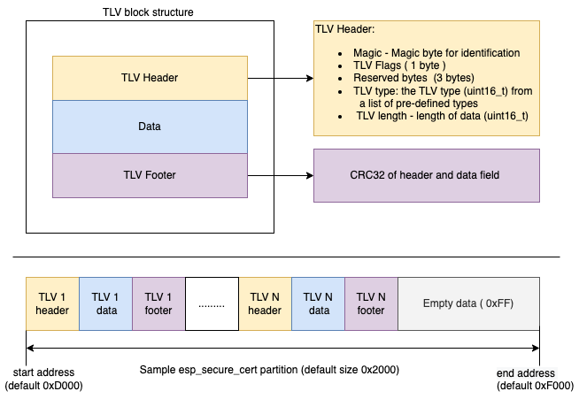

# `esp_secure_cert` partition format

## TLV format

The `esp_secure_cert` partition uses TLV format by default. TLV format has been decided based on its simplicity and efficiency. We use customized headers specifically designed for the `esp_secure_cert` partition. The `esp_secure_cert` partition is supposed to be a READ-only partition which can contain the data which is bound to the device and is not usually updated e.g. Device private key, Device certificate, CA certificate. Currently `esp_secure_cert_mgr` component does not support modification of the `esp_secure_cert` partition.

The TLV format used in the esp_secure_cert partition is as follows:



* TLV header: It contains the information regarding the data such as the type of the data and the length of the data. For more details about the TLV, please take a look at [tlv_config.h](https://github.com/espressif/esp_secure_cert_mgr/tree/main/private_include/esp_secure_cert_tlv_config.h).

    * i) TLV type: Currently the TLV format supports only a list of pre-defined types. The latest list for pre-defined types can be found at [tlv_config.h](https://github.com/espressif/esp_secure_cert_mgr/tree/main/private_include/esp_secure_cert_tlv_config.h). Additional custom types are also provided in order to allow storing custom data in TLV format. The custom data types can be typecasted to appropriate types after reading the TLV.
    * ii)  TLV flags field - flags byte that identifies different characteristics for the TLV

* TLV footer: It contains the crc32 of the data and header field.
* TLV format Padding - In TLV format a padding is added automatically between the end offset of data and TLV footer. The padding is added in order to make the data field a multiple of 16 bytes which is the minimum alignment required for flash encrypted writes.


### Partition table entry
* For TLV format the `partitions.csv` file for the project should contain the following line which enables it to identify the `esp_secure_cert` partition:

```
# Name, Type, SubType, Offset, Size, Flags
esp_secure_cert, 0x3F, , 0xD000, 0x2000, encrypted
```

Please note that, TLV format uses compact data representation and hence partition size is kept as 8KiB.

> Note: The TLV read API expects that a padding of appropriate size is added to data to make it size as a multiple of 16 bytes, the partition generation utility i.e. [configure_esp_secure_cert.py](https://github.com/espressif/esp_secure_cert_mgr/blob/main/tools/configure_esp_secure_cert.py) takes care of this internally while generating the partition.

When flash encryption is enabled for the device it is imporatant to encrypt the `esp_secure_cert` partition as well. Adding the encrypted flag in the partition table as done above can ensure that this is done. When flash encryption is not enabled this flag shall be ignored.

## Legacy formats for `esp_secure_cert` partition:
`esp_secure_cert` partition also supports two legacy flash formats.
The support for these can be enabled through following menuconfig option:
* `Component config > ESP Secure Cert Manager -> Enable support for legacy formats`

1) *cust_flash*: In this case, the partition is a custom flash partition. The data is directly stored over the flash.
* In this case the `partitions.csv` file for the project should contain the following line which enables it to identify the `esp_secure_cert` partition.

```
# Name, Type, SubType, Offset, Size, Flags
esp_secure_cert, 0x3F, , 0xD000, 0x6000, encrypted
```
When flash encryption is enabled the behaviour is same as mentioned above for the TLV format.

2) *nvs partition*: In this case, the partition is of the `nvs` type. The `nvs_flash` abstraction layer from the ESP-IDF is used to store and then retreive the contents of the `esp_secure_cert` partition.

* In this case the `partitions.csv` file for the project should contain the following line which enables it to identify the `esp_secure_cert` partition.

```
# Name, Type, SubType, Offset, Size, Flags
esp_secure_cert, data, nvs, 0xD000, 0x6000,
```
Currently the nvs encryption option is not supported for the `esp_secure_cert` partition.
